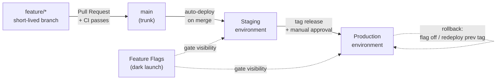

# Development Workflow

This project uses **trunk-based development** with **feature flags** and a
promotion pipeline from **staging** to **production**. The five pillars:

**`feature/*` branches → feature flags → `main` (trunk) → Staging → Production**

The goal is a trunk that is *always releasable*. Work is integrated in small,
frequent pull requests; anything not ready for users is hidden behind a flag
rather than held on a long-lived branch.



---

## The five pillars

### 1. Feature branches
Short-lived branches cut from the latest `main`. Ideally merged within a day or
two — the longer a branch lives, the more painful the integration.

- Naming: `feat/<slug>`, `fix/<slug>`, `chore/<slug>`, `docs/<slug>`.
- One logical change per branch. Split big work into flag-guarded increments.
- Rebase or merge `main` in frequently to stay current.
- Deleted automatically after the PR is squash-merged.

### 2. Feature flags
Flags decouple **landing code** from **activating a feature**: you can merge
unfinished work to trunk with its flag off (dark) so trunk stays releasable, then
switch the feature on as a separate step.

- The flag registry lives in [`flags/flags.json`](../flags/flags.json).
- Every flag has per-environment values (`staging`, `production`).
- New flags default to `staging: true`, `production: false` — visible for
  validation on staging, dark in production until you deliberately flip it.
- **Values are resolved from the deployed build.** The in-repo resolvers read
  `flags.json` from whatever release is running, so flipping a *production* flag
  takes effect on the next release/redeploy — a small, config-only deploy, not a
  code change. For an *instant* runtime toggle with no redeploy, swap the file
  source for a hosted flag service (same call sites).
- Flags are **temporary**. Each carries a `cleanupBy` date; remove the flag and
  the dead code path once the feature is fully rolled out.
- See [`flags/README.md`](../flags/README.md) for the full lifecycle and the
  hosted-service upgrade.

### 3. Trunk (`main`)
The single source of truth. Every change lands here through a reviewed PR.

- **No direct pushes.** All changes arrive via pull request.
- **CI must pass** before merge (build/test + flag validation).
- **Squash merge** keeps history linear and each trunk commit releasable.
- Protected by branch rules — see [`environments.md`](./environments.md).

### 4. Staging
A production-like environment that mirrors trunk.

- **Auto-deploys on every merge to `main`**
  (`.github/workflows/deploy-staging.yml`).
- Flags resolve to their `staging` values, so in-progress features are visible
  here first.
- This is where you validate a change end-to-end before promoting it.

### 5. Production
The live environment users see.

- **Deploys on a published GitHub Release**
  (`.github/workflows/deploy-production.yml`), i.e. an explicit, tagged
  promotion — not on every merge.
- Gated by the GitHub `production` **environment** with required reviewers, so a
  human approves each production deploy.
- Flags resolve to their `production` values — new features stay dark until
  flipped on.

---

## End-to-end lifecycle

1. **Branch** off the latest `main`: `git switch -c feat/parent-dashboard`.
2. **Build behind a flag** if the work isn't shippable in one step. Register the
   flag in `flags/flags.json` (`production: false`).
3. **Open a pull request.** CI runs build/test and validates the flag registry.
4. **Review & merge** (squash). The branch is deleted.
5. **Staging deploy** runs automatically. Validate the change there with its flag
   on.
6. **Promote to production** by publishing a release (see below). The
   `production` environment gate requires an approval.
7. **Turn the flag on** in production with a one-line PR flipping
   `production: true`, then release/redeploy so production picks up the new value
   (file flags are read from the deployed build — the flip takes effect on that
   deploy, not on merge).
8. **Clean up** the flag and dead code once the rollout is complete.

---

## Environment matrix

| Aspect              | Feature branch      | Staging                       | Production                       |
| ------------------- | ------------------- | ----------------------------- | -------------------------------- |
| Deploys on          | PR preview (opt-in) | merge to `main`               | published release / manual promote |
| Trigger workflow    | `ci.yml`            | `deploy-staging.yml`          | `deploy-production.yml`          |
| Flag values         | `development`       | `staging`                     | `production`                     |
| Approval required   | no                  | no                            | yes (environment reviewers)      |
| Stability guarantee | may break           | production-like, may show WIP | stable, user-facing              |

---

## Releasing & promoting to production

Production deploys are deliberate, tagged promotions:

1. Ensure the change is validated on staging.
2. Create a release — tag `main` with a semantic version:
   ```bash
   git switch main && git pull
   git tag v1.4.0 -m "Parent dashboard, video drill library"
   git push origin v1.4.0
   ```
   Then publish a GitHub Release for that tag (auto-generated notes are
   configured in `.github/release.yml`).
3. Publishing the release triggers `deploy-production.yml`, which pauses on the
   `production` environment gate for approval.
4. Approve → production deploys the exact tagged commit.

Keep [`CHANGELOG.md`](../CHANGELOG.md) up to date under **Unreleased**; move
entries under the version heading when you cut a release.

---

## Rollback

Two levers, smallest blast radius first:

- **Flag rollback (smallest change):** flip the feature's `production` value back
  to `false`. This is a config-only change — far lower risk than reverting code.
  With the in-repo file flags it applies on a redeploy: re-run
  `deploy-production.yml` with the current production tag (or cut a new release).
  A hosted flag service would make this instant, with no redeploy.
- **Deploy rollback:** re-run `deploy-production.yml` via **Run workflow** and
  pass the previous good tag as the `ref` input to redeploy the last known-good
  build.

---

## Setting it up on GitHub

Branch protection, environments, and the approval gate are configured in the
repository settings, not in code. See [`environments.md`](./environments.md) for
the exact settings (and an optional `gh`-based setup script).
